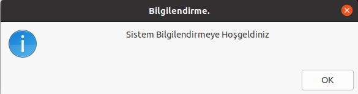
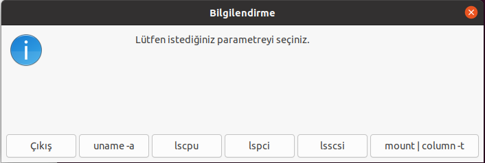
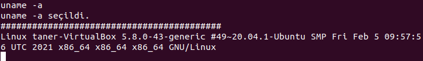

# Sistem Bilgisi Öğrenme için Görsel Arayüz
## Özet
Bu proje Linux Araçları ve Kabuk Programlama dersi için Shell Programalama ödevidir.

## Proje Amacı
wget komutunu değişik parametrelerle çalıştıran shell scriptine zenity kullanarak görsel bir arayüz oluşturulmuştur.

# Kurulum
## Github Üzerinden Kurulum

Resimdeki adımları takip ederek kodu zip olarak indirin.
Zipten çıkarın.
Zipten çıkarılmış klasörde terminali açınız.
bash system.sh komutunu çalıştırınız.

## Git Üzerinden Kurulum
- git clone https://github.com/tanersolak/zenity_project.git
- cd zenity_project
- bash system.sh

# Uygulama Görüntüleri

## Giriş

- İlk olarak uygulama bildirimi bizi karşılıyor OK'a basarak parametre seçimi kısmına ilerliyoruz.

## Parametre Seçimi

- Kullanıcı burada hangi parametreleri kullanmak istediğini seçiyor ve ÇIKIŞ butonuna basana kadar seçim yapması isteniyor.

## uname -a Parametresi

- uname -a parametresi; bilgisayarınızın donanım adının tamamını yazdırır.

## lscpu Parametresi

- lscpu parametresi; CPU ve işlemci üniteleri hakkında detaylı bilgi verir.

## lspci Parametresi

- lspci parametresi; tüm pci veriyollarını ve bunlara bağlı cihazlarla ilgili ayrıntıları listeler.

## lsscsi Parametresi

- lsscsi parametresi; sabit sürücüler ve optik sürücüler gibi scsi/sata aygıtlarını listeler.

## mount | column -t Parametresi

- mount | column -t parametresi; takılı dosya sistemlerini takmak/bağını kaldırmak ve görüntülemek için kullanılır. 

# Teknolojiler
- Bash Script
- Zenity
- Nano
